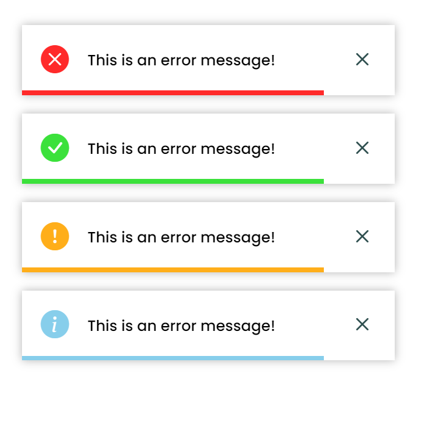

# Toastify 

JavaScript Library for Creating simple toast's. 
With very minimal configurations you can create a good toast alerts. [Visit Example Page](https://suraj-repositories.github.io/JS-Toastify/)

## Images
<div align="center">
    
</div>

## Usage
To use this you need to link the stylesheet and script file to you html file like 
<br>
<br>
For this case only i will suggest you to put them inside header tag, so the toast functionlity will available to your entire application.

```html
<head>
<title> Test </title>

<!-- stylesheet -->
<link rel="stylesheet" href="./style.css">

<!-- icons -->
<link rel="stylesheet" href="https://cdn.jsdelivr.net/npm/bootstrap-icons@1.11.3/font/bootstrap-icons.min.css">

<!-- script -->
<script src="./script.js"></script>
</head>

```

## Currently supported functions 

```html
<script>
    Toastify.error("This is an error message!");
    Toastify.success("This is an success message!");
    Toastify.warning("This is an warning message!");
    Toastify.info("This is an informational message!");
</script>
```
You can pass the additional argument to control the time of toast message

```js
    Toastify.error("This is an success message!", 10000);   // 10 seconds = 10 x 1000
```

# Conclution
This project is currently under development. We will add more customizations in the near future.
